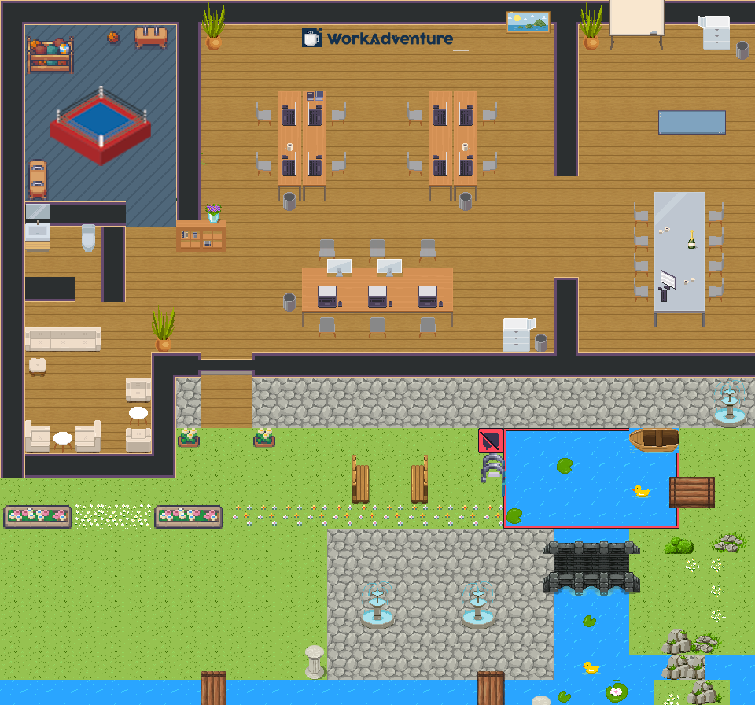
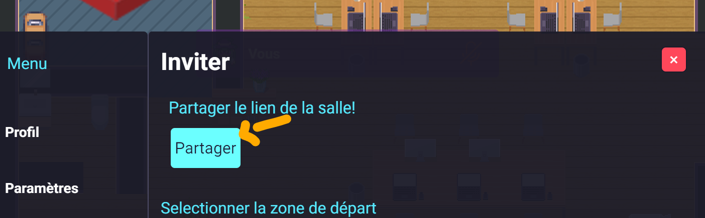

# WorkAdventure Map



## Fonctionnalités

### 3. Hemavathi Birabourame 

> Github: hema-brm

- Suivi de paiement
  - Ajout / Modification / Suppression / Liste

### 1. Racha Ramoul

> Github: RachaRamoul

- Suivi de paiement
  - Ajout / Modification / Suppression / Liste
  - Sécurité
- 

### 2. Sarah Lina Salamani

> Github: Sarahlyna
 
- Authentification
  - Création table utilisateurs

## Procédure d'installation et de lancement

* Clone le projet : 

```shell
git clone git@github.com:RachaRamoul/Hackathon24.git
```

* Se mettre sur le dossier du projet et installer les dépendances :

```shell
cd Hackathon24
npm install
```

* Ouvrir un deuxième terminal et se mettre sur le dossier jira-game-server puis installer les dépendances du serveur : 

```shell
    cd Hackathon24/jira-game-server
    npm install
```

* Lancer le serveur local : 

```shell
    node server.js
```

* se remettre sur le premier terminal et lancer le serveur WorkAdventure : 

```shell
    npm run start
```

## Procédure de test

* Se connecter sur WorkAdventure avec votre premier Waka et copier le lien d'invitation en cliquant sur le bouton "inviter" en bas.



* Coller le lien dans un navigateur et se connecter en tant que 2ème Waka.

* Diriger les 2 Wakas dans le ring et lancer le jeu en même temps.

* Inscrire les informations des joueurs et la durée du match avec l'un des deux Wakas, puis lancer.

## Exigences

Node.js version >=17

